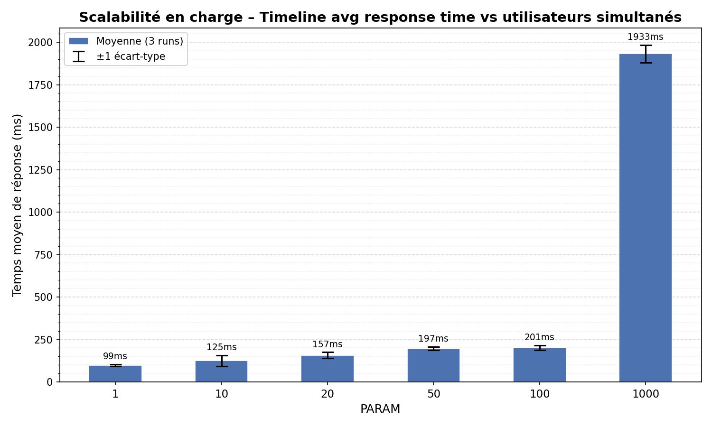
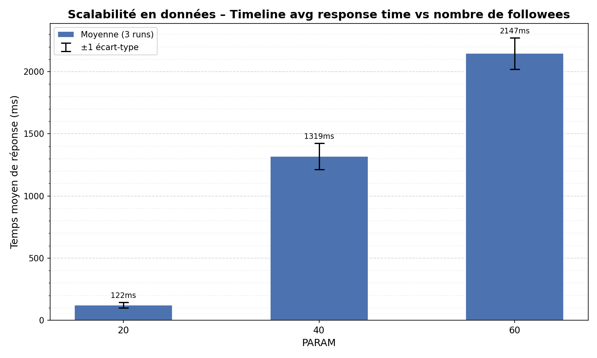

# TinyInsta — Does/How TinyInsta Scales?

Mini réseau social déployé sur **Google App Engine** (PaaS, Standard F1) avec **Google Cloud Datastore** comme backend de persistance.  
Repo basé sur [momo54/massive-gcp](https://github.com/momo54/massive-gcp).

---

## Architecture

- **`main.py`** — Application Flask exposant une UI HTML minimale et un endpoint JSON `/api/timeline`
- **`seed.py` / `seed_fast.py`** — Peuplement du Datastore (utilisateurs, follows, posts) avec batch writes
- **`locustfile.py`** — Scénario de charge Locust : chaque utilisateur virtuel interroge `/api/timeline?user=userN`
- **`benchmark.py`** — Orchestration des deux expériences (concurrence et fanout), génération des CSV
- **`plot.py`** — Génération des barplots depuis les CSV
- **`app.yaml`** — Configuration App Engine (runtime Python 3.10, instance F1, auto-scaling)
- **`index.yaml`** — Index composite Datastore requis pour `WHERE author IN (...) ORDER BY created DESC`

### Requête timeline

```sql
SELECT * FROM Post WHERE author IN @authors ORDER BY created DESC
```

La liste `@authors` contient l'utilisateur lui-même + tous ses followees. Cette requête est implémentée par le Datastore comme **N scans parallèles** (un par auteur) fusionnés ensuite — c'est le point central pour comprendre les résultats.

---

## Expérience 1 — Scalabilité en charge

**Paramètres fixes :** 1 000 utilisateurs, 50 posts/utilisateur, 20 followees par utilisateur.  
**Variable :** nombre d'utilisateurs simultanés → 1, 10, 20, 50, 100, 1 000.  
**Mesure :** temps moyen de réponse de `/api/timeline` (ms), 3 runs par configuration.



| PARAM (users simultanés) | Temps moyen |
|:---:|---:|
| 1 | 99 ms |
| 10 | 125 ms |
| 20 | 157 ms |
| 50 | 197 ms |
| 100 | 201 ms |
| 1 000 | 1 933 ms |

---

## Expérience 2 — Scalabilité en données (fanout)

**Paramètres fixes :** 1 000 utilisateurs, 100 posts/utilisateur, 50 utilisateurs simultanés.  
**Variable :** nombre de followees → 20, 40, 60.  
**Mesure :** temps moyen de réponse de `/api/timeline` (ms), 3 runs par configuration.



| PARAM (followees) | Temps moyen |
|:---:|---:|
| 20 | 122 ms |
| 40 | 1 319 ms |
| 60 | 1 580 ms |

---

## Interprétation — Ça scale ou pas ?

### ✅ Sur la charge : oui, ça scale (grâce à App Engine)

De 1 à 100 utilisateurs simultanés, le temps de réponse reste très raisonnable (99 ms → 201 ms). App Engine auto-scale automatiquement le nombre d'instances F1 en fonction de la charge : à 100 users simultanés, on observe jusqu'à 4 instances actives. Le service absorbe la montée en charge sans dégradation majeure.

À 1 000 utilisateurs simultanés, le temps monte à ~1 933 ms. Cette dégradation s'explique principalement par le fait que **les instances ont été réinitialisées (reset) avant chaque run** pour garantir la reproductibilité des mesures. App Engine doit alors provisionner de nouvelles instances à froid (*cold start*) : la première vague de requêtes arrive avant que les instances ne soient pleinement opérationnelles, ce qui gonfle artificiellement le temps de réponse mesuré. En régime établi (instances déjà chaudes), les performances seraient significativement meilleures. **Le mécanisme de scaling horizontal fonctionne bien — c'est le coût du démarrage à froid qui se voit ici.**

### ❌ Sur les données : non, ça ne scale pas

C'est ici que le problème de conception apparaît clairement. Passer de 20 à 40 followees **multiplie le temps de réponse par ~10** (122 ms → 1 319 ms), et 60 followees donne 1 580 ms.

**Pourquoi ?** La requête timeline repose sur un `IN` Datastore :

```sql
SELECT * FROM Post WHERE author IN [user1, user2, ..., userN] ORDER BY created DESC
```

Le Datastore n'a **pas de JOIN natif**. Cette requête est exécutée comme **N scans indépendants** (un par followee), puis fusionnés et triés côté serveur. Plus on a de followees, plus on fait de scans, plus on lit d'entités — et la facture en latence (et en coût Datastore !) croît rapidement.

**C'est un problème architectural fondamental :** un NoSQL shardé comme Datastore (ou Firestore) n'est pas conçu pour ce type de requête agrégée multi-entités. Il excelle pour les lookups par clé et les lectures simples, mais pas pour reconstruire à la volée une timeline en scannant les posts de dizaines d'utilisateurs.

### Ce qu'il faudrait faire

Pour un vrai réseau social scalable, la bonne approche est le **fan-out à l'écriture** (write-time fan-out) :
- Quand un utilisateur poste un message, on **copie** ce post dans la timeline de chacun de ses followers (dénormalisation).
- La lecture de la timeline devient un simple lookup par clé → O(1) quelle que soit la taille du réseau.
- Le coût se déplace de la lecture vers l'écriture, ce qui est le bon compromis pour un réseau social (lecture >> écriture).

---

## Lancer les benchmarks

### Prérequis

```bash
pip install -r requirements_benchmark.txt
```

### Seeder les données

```bash
# Expérience concurrence (50 posts/user, 20 follows)
python seed_fast.py --users 1000 --posts-per-user 50 --follows 20 --clear

# Expérience fanout (100 posts/user, varies follows)
python seed_fast.py --users 1000 --posts-per-user 100 --follows 40 --clear
```

### Lancer les benchmarks

```bash
python benchmark.py --app-url https://YOUR_PROJECT.uc.r.appspot.com

# Ou séparément :
python benchmark.py --app-url https://... --only-conc
python benchmark.py --app-url https://... --only-fanout
```

### Générer les graphiques

```bash
python plot.py
# Produit out/conc.png et out/fanout.png
```

---

## Déploiement

```bash
gcloud init
gcloud app create
pip install -r requirements.txt
gcloud datastore indexes create index.yaml
gcloud app deploy
```

Vérifier les instances actives :

```bash
gcloud app instances list
```

---

## Structure du projet

```
.
├── main.py                    # Application Flask
├── app.yaml                   # Config App Engine
├── index.yaml                 # Index composite Datastore
├── requirements.txt           # Dépendances app
├── seed.py                    # Seeder (version simple)
├── seed_fast.py               # Seeder (batch writes, rapide)
├── locustfile.py              # Scénario de charge Locust
├── benchmark.py               # Orchestration des expériences
├── plot.py                    # Génération des barplots
├── requirements_benchmark.txt # Dépendances benchmark
└── out/
    ├── conc.csv               # Résultats expérience charge
    ├── fanout.csv             # Résultats expérience données
    ├── conc.png               # Barplot charge
    └── fanout.png             # Barplot données
```
